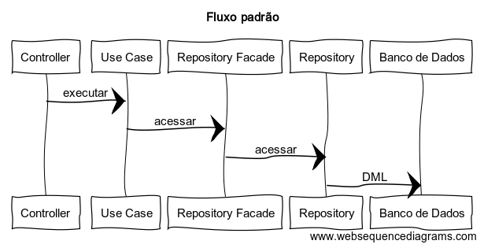
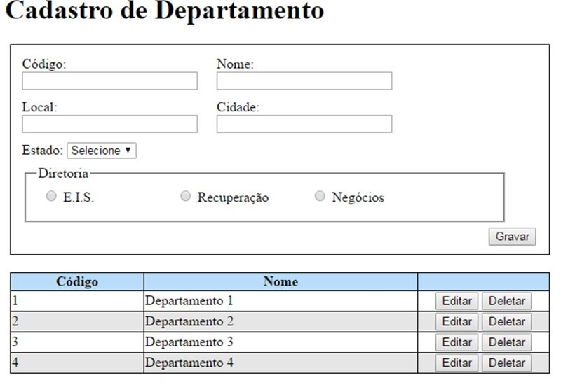

# Teste Java #


De acordo com as orientações abaixo, desenvolva um sistema web. 

- Utilize este repositório para armazenar seus códigos-fonte.
- A aplicação deverá ser funcional.
- Você deverá apresentar sua solução na entrevista.
- Contato para dúvidas: eloi.mendes@omni.com.br ou claudio@omni.com.br

## Tecnologias ##

- **Java**: OPENJDK_11
- **SPRING BOOT**: versão 2.3.1
- **Banco de dados**: utilize um banco relacional (Oracle, PostgreSQL, MySQL)
- **Front**: livre escolha
- **Build tool**: Maven ou Gradle

## Camadas



### Controller

Responsável por receber as requisições HTTP. Realiza conversões e validações de dados.

### Use case

Contém um método público chamado `executar` referente a uma regra de negócio. 

### Repository Facade

Responsável por intermediar os acessos aos dados, seja por meio de Repository ou API. 

### Repository

Executa operações de leitura/escrita no banco de dados. Deve ter `privilégio de classe` e ser acessado somente pelo RepositoryFacade.

### Entity

Mapeia uma tabela do banco de dados.

### Regras

- Adicione o sufixo Entity. Exemplo: UsuarioEntity.java
- Evite abreviações. Exemplo: qtd x quantidade, tot x total
- Utilize boolean ao invés de S/N ou 0/1
- Utilize Enum em atributos de domínio. Exemplo: Sexo(MASCULINO, FEMININO)


## Padrões REST


- Os nomes das urls e dos atributos devem ser em inglês
- Utilize substantivos no plural, no lugar de verbos, para representar recursos.
	- Exemplo: http://localhost:8080/api/addresses
- Utilize somente letras minúsculas, com hyphen "-" para separar palavras.
	- Exemplo: http://localhost:8080/api/professional-classes
- Use sub recursos nos relacionamentos, através do caractere barra "/".
	- Exemplo: http://localhost:8080/api/addresses/cities
- Em uma consulta, receba os filtros através de query parameters.
	- Exemplo: [http://localhost:8080/api/addresses?city=SAO%20PAULO&logradouro=Sao%20Gabriel&uf=SP](http://localhost:8080/api/addresses?city=SAO PAULO&logradouro=Sao Gabriel&uf=SP)
- Método GET deve ser utilizado somente em consultas e não deve atualizar informações da aplicação.
- Retorne os dados no formato JSON.
- Utilize nomes de atributos em camel case. Exemplo: professionalClasses
- Utilize boolean no lugar de S/N ou 0/1, em valores binários

### Verbos HTTP

- GET: Consulta
- POST: Inserção
- PUT: Atualizacão
- DELETE: Remoção/inativação

### Códigos de retorno HTTP

- 200: OK
	- Consultas
- 201: Registro criado
	- Inserção de registros
- 202: Recurso em processamento
- 400: Entrada inválida
	- Exemplo: O usuário não preencheu um campo obrigatório
- 401: Sem autenticação ou autenticação inválida
- 403: Sem permissão no recurso
- 404: Registro inexistente
	- Exemplo: Busca de um usuário por ID
- 422: Erros de regras de negócio
	- Exemplo: A porcentagem de entrada deve ser maior que 15%
- 500: Erro inesperado

### Respostas

Todas as respostas devem ter os atributos status e messages. 

Exemplo:

```
{
    "status":"SUCCESS",
    "messages":[{"Process executed successfully"}]
}
```


## Aplicação a ser desenvolvida:

### Funcionalidades:

- Cadastrar departamentos
- Editar departamentos
- Deletar departamentos
- Listar departamentos pelo código, de forma ascendente

### Considere:
- experiência do usuário
- performance da aplicação
- boas práticas de desenvolvimento
- testes unitários

## Protótipo:



